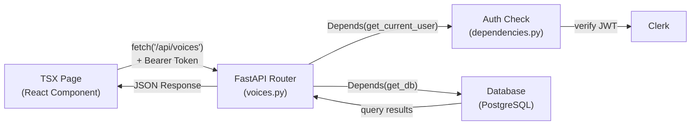
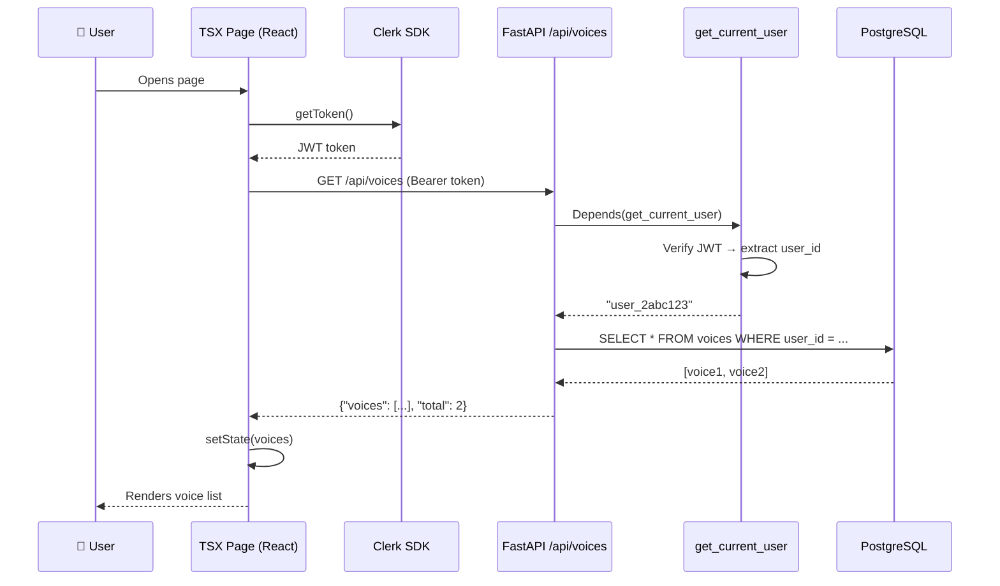

# 🔄 Data Flow: FastAPI Backend → Next.js Frontend

## The Big Picture



---

## Step-by-Step Flow (Using Your Voice Clone Feature)

### 🟢 Step 1: FastAPI defines the API endpoint

In [voices.py](file:///c:/Users/chhaya%20jay/Desktop/Tarang/apps/api/app/routers/voices.py), you define a **router** with endpoints:

```python
# apps/api/app/routers/voices.py

router = APIRouter(prefix="/api/voices", tags=["voices"])

@router.get("")
async def list_voices(
    clerk_user_id: str = Depends(get_current_user),  # ← Auth check
    db: Session = Depends(get_db),                     # ← DB session
):
    # Query the database for this user's voices
    voices = db.query(Voice).filter(Voice.clerk_user_id == clerk_user_id).all()
    return {"voices": voices, "total": len(voices)}
```

### 🟢 Step 2: Router is registered in the main app

In [main.py](file:///c:/Users/chhaya%20jay/Desktop/Tarang/apps/api/app/main.py), the router is plugged into FastAPI:

```python
# apps/api/app/main.py

app = FastAPI(title="Tarang API")
app.include_router(voices.router)  # ← Now /api/voices is live!
```

> [!NOTE]
> `include_router` takes the router's `prefix="/api/voices"` and makes all its endpoints available under that path. So `@router.get("")` becomes `GET /api/voices`.

### 🟢 Step 3: Auth middleware validates the request

When a request hits `/api/voices`, FastAPI runs `Depends(get_current_user)` **before** the endpoint function:

```python
# apps/api/app/dependencies.py

async def get_current_user(request: Request) -> str:
    auth_header = request.headers.get("Authorization")
    # Extracts "Bearer <token>" → verifies JWT with Clerk
    token = auth_header.removeprefix("Bearer ").strip()
    payload = verify_clerk_token(token)
    return payload.get("sub")  # ← Returns clerk_user_id like "user_2abc123"
```

### 🟢 Step 4: TSX page calls the API

This is where your **Next.js frontend connects to FastAPI**. In your TSX page, you use `fetch()` to call the API:

```tsx
// apps/app/src/app/instant-voice-clone/page.tsx

"use client";
import { useEffect, useState } from "react";
import { useAuth } from "@clerk/nextjs";

export default function InstantVoiceClonePage() {
  const { getToken } = useAuth();       // ← Clerk gives you the JWT
  const [voices, setVoices] = useState([]);

  useEffect(() => {
    async function fetchVoices() {
      const token = await getToken();    // ← Get the JWT from Clerk

      const res = await fetch("http://localhost:8000/api/voices", {
        headers: {
          "Authorization": `Bearer ${token}`,  // ← Send it to FastAPI
        },
      });

      const data = await res.json();     // ← Parse the JSON response
      setVoices(data.voices);            // ← Update React state
    }

    fetchVoices();
  }, []);

  return (
    <div>
      {voices.map((voice) => (
        <div key={voice.id}>{voice.name}</div>
      ))}
    </div>
  );
}
```

---

## The Complete Request Lifecycle



---

## Mapping URLs to Code

| Frontend calls...            | FastAPI handles it in...         | Decorator                  |
|-------------------------------|----------------------------------|----------------------------|
| `GET /api/voices`             | `voices.py → list_voices()`     | `@router.get("")`          |
| `POST /api/voices/upload`     | `voices.py → upload_voice()`    | `@router.post("/upload")`  |
| `POST /api/voices/abc/clone`  | `voices.py → trigger_clone()`   | `@router.post("/{voice_id}/clone")` |
| `GET /api/voices/abc/status`  | `voices.py → get_clone_status()`| `@router.get("/{voice_id}/status")` |
| `DELETE /api/voices/abc`      | `voices.py → delete_voice()`    | `@router.delete("/{voice_id}")` |

---

## Upload Example (POST with File)

Here's how the Upload button in your TSX would send a file to FastAPI:

### Backend (FastAPI)
```python
# voices.py
from fastapi import UploadFile, File

@router.post("/upload")
async def upload_voice(
    file: UploadFile = File(...),                     # ← Receives the file
    clerk_user_id: str = Depends(get_current_user),
    db: Session = Depends(get_db),
):
    contents = await file.read()
    # Save to storage, create DB record...
    return {"voice_id": "new-voice-123", "filename": file.filename}
```

### Frontend (TSX)
```tsx
async function handleUpload(file: File) {
  const token = await getToken();

  const formData = new FormData();
  formData.append("file", file);        // ← Attach the audio file

  const res = await fetch("http://localhost:8000/api/voices/upload", {
    method: "POST",
    headers: {
      "Authorization": `Bearer ${token}`,
    },
    body: formData,                     // ← Send as multipart form data
  });

  const data = await res.json();
  console.log(data.voice_id);           // ← "new-voice-123"
}
```

---

## Summary: The Chain

```
TSX Component
  ↓ fetch() with Bearer token
FastAPI Router (voices.py)
  ↓ Depends() runs auth + db
Dependencies (dependencies.py)
  ↓ verifies JWT, opens DB session
Endpoint function runs
  ↓ queries database, processes data
JSON Response
  ↓ returned to frontend
React state updates → UI re-renders
```

> [!TIP]
> **Key concept:** The TSX file and FastAPI are **two separate servers** talking over HTTP. Clerk is the bridge that ensures both sides know *who* the user is — the frontend gets a token from Clerk, and the backend verifies that same token.
