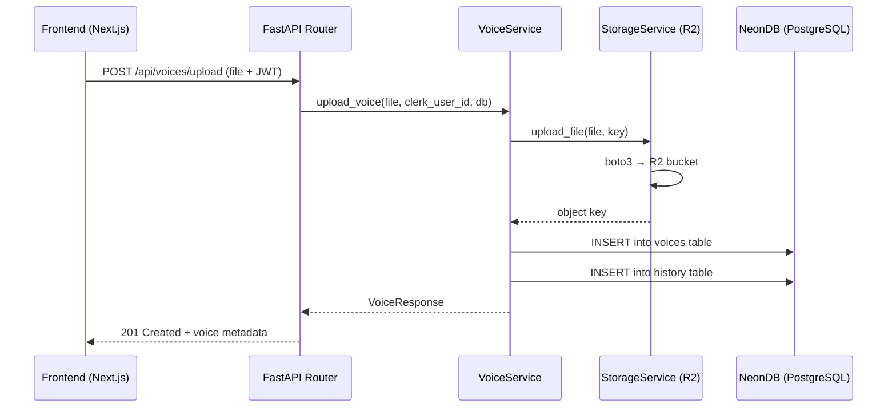

# Cloudflare R2 Storage + NeonDB Metadata Integration

Integrate Cloudflare R2 (S3-compatible) as the audio file storage provider and wire up the existing voice router stubs with real logic that saves metadata to NeonDB via SQLAlchemy.

## User Review Required

> [!IMPORTANT]  
> **R2 API Credentials Needed**: You need to create an R2 API Token from the Cloudflare Dashboard:  
> `Cloudflare Dashboard → R2 Object Storage → Manage R2 API Tokens → Create API Token`  
> This will give you an **Access Key ID** and **Secret Access Key**. Add them to `.env` (see below).

> [!WARNING]  
> **Public Access**: The current plan generates **pre-signed URLs** (temporary, expiring links) for serving audio. If you want files to be **permanently public** via a custom domain, let me know and I'll adjust the approach.

## Parsed from your S3 API URL

From `https://4ea762f61bb47771cd6d7883afda33e2.r2.cloudflarestorage.com/audio`:

| Setting | Value |
|---------|-------|
| Account ID | `4ea762f61bb47771cd6d7883afda33e2` |
| R2 Endpoint | `https://4ea762f61bb47771cd6d7883afda33e2.r2.cloudflarestorage.com` |
| Bucket Name | `audio` |

---

## Proposed Changes

### Dependencies

#### [MODIFY] [pyproject.toml](file:///c:/Users/chhaya%20jay/Desktop/Tarang/apps/api/pyproject.toml)
- Add `boto3` — AWS SDK that works with R2's S3-compatible API
- Add `python-multipart` — required by FastAPI for `UploadFile` handling

---

### Configuration

#### [MODIFY] [.env](file:///c:/Users/chhaya%20jay/Desktop/Tarang/apps/api/.env)
Add R2 credentials:
```env
# Cloudflare R2 Storage
R2_ENDPOINT_URL=https://4ea762f61bb47771cd6d7883afda33e2.r2.cloudflarestorage.com
R2_ACCESS_KEY_ID=<your-r2-access-key>
R2_SECRET_ACCESS_KEY=<your-r2-secret-key>
R2_BUCKET_NAME=audio
```

#### [MODIFY] [config.py](file:///c:/Users/chhaya%20jay/Desktop/Tarang/apps/api/app/config.py)
Replace the generic `STORAGE_*` fields with explicit R2 settings:
```python
# Cloudflare R2
R2_ENDPOINT_URL: str = os.getenv("R2_ENDPOINT_URL", "")
R2_ACCESS_KEY_ID: str = os.getenv("R2_ACCESS_KEY_ID", "")
R2_SECRET_ACCESS_KEY: str = os.getenv("R2_SECRET_ACCESS_KEY", "")
R2_BUCKET_NAME: str = os.getenv("R2_BUCKET_NAME", "audio")
```

---

### Services (New Files)

#### [NEW] [storage_service.py](file:///c:/Users/chhaya%20jay/Desktop/Tarang/apps/api/app/services/storage_service.py)
R2 storage operations via `boto3`:

| Method | Purpose |
|--------|---------|
| `upload_file(file, key)` | Upload `UploadFile` to R2, returns the object key |
| `generate_presigned_url(key)` | Generate a temporary download URL (1 hour expiry) |
| `delete_file(key)` | Delete object from R2 |
| `_get_client()` | Internal: creates boto3 S3 client configured for R2 |

File keys will follow: `voices/{clerk_user_id}/{voice_id}/{filename}`

#### [NEW] [voice_service.py](file:///c:/Users/chhaya%20jay/Desktop/Tarang/apps/api/app/services/voice_service.py)
Business logic orchestration:

| Method | Purpose |
|--------|---------|
| `upload_voice(file, clerk_user_id, db)` | Upload to R2 → create Voice record → create History entry → return VoiceResponse |
| `list_user_voices(clerk_user_id, db)` | Query all voices for a user |
| `get_voice(voice_id, clerk_user_id, db)` | Fetch single voice with ownership check |
| `get_clone_status(voice_id, clerk_user_id, db)` | Return current clone status |
| `delete_voice(voice_id, clerk_user_id, db)` | Delete from R2 + DB + log History |
| `trigger_clone(voice_id, clerk_user_id, db)` | Update status to "processing" + log History (actual GPU dispatch is Phase 3) |

---

### Router (Wire Stubs)

#### [MODIFY] [voices.py](file:///c:/Users/chhaya%20jay/Desktop/Tarang/apps/api/app/routers/voices.py)
Replace all 6 stub endpoints with real logic that delegates to `voice_service`:

| Endpoint | What it will do |
|----------|----------------|
| `POST /upload` | Accept `UploadFile`, call `voice_service.upload_voice()`, return `VoiceResponse` |
| `POST /{voice_id}/clone` | Call `voice_service.trigger_clone()`, return `CloneStatusResponse` |
| `GET /` | Call `voice_service.list_user_voices()`, return `VoiceListResponse` |
| `GET /{voice_id}` | Call `voice_service.get_voice()`, return `VoiceResponse` |
| `GET /{voice_id}/status` | Call `voice_service.get_clone_status()`, return `CloneStatusResponse` |
| `DELETE /{voice_id}` | Call `voice_service.delete_voice()`, return success message |

---

### Context Map

#### [MODIFY] [Agent.md](file:///c:/Users/chhaya%20jay/Desktop/Tarang/Agent.md)
- Update storage decision → ✅ Cloudflare R2
- Mark `storage_service.py` and `voice_service.py` as ✅ DONE
- Update voice router status from 🔧 STUBS to ✅ Working (upload/list/get/delete)
- Update changelog

---

## Architecture Flow



---

## Open Questions

> [!IMPORTANT]  
> **Do you have your R2 Access Key ID and Secret Access Key ready?** If not, go to:  
> `Cloudflare Dashboard → R2 → Manage R2 API Tokens → Create API Token`  
> Select "Object Read & Write" permission for the `audio` bucket.

> [!NOTE]  
> The clone endpoint (`POST /{voice_id}/clone`) will update status to "processing" and log a history entry, but the actual GPU dispatch (RunPod) is deferred to a later phase. Is that acceptable for now?

---

## Verification Plan

### Automated Tests
1. Start the server: `uv run uvicorn app.main:app --reload`
2. Test upload: `curl -X POST http://localhost:8000/api/voices/upload -H "Authorization: Bearer <token>" -F "file=@sample.wav"`
3. Verify file appears in R2 bucket via Cloudflare Dashboard
4. Test list: `curl http://localhost:8000/api/voices -H "Authorization: Bearer <token>"`
5. Test delete: verify file removed from R2 and DB

### Manual Verification
- Check NeonDB for new rows in `voices` and `history` tables
- Check Cloudflare R2 dashboard for uploaded files
- Verify pre-signed URLs work (download the file via returned URL)
